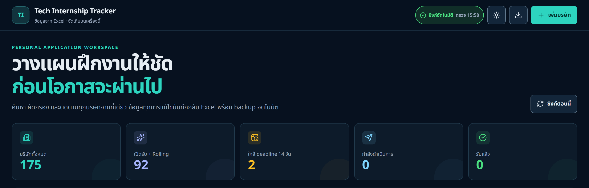
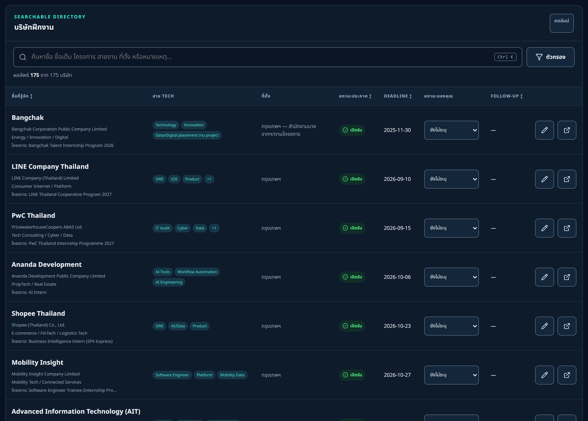
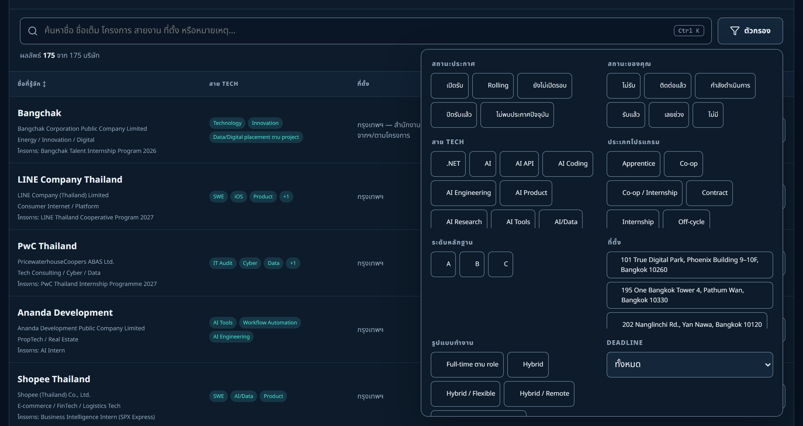
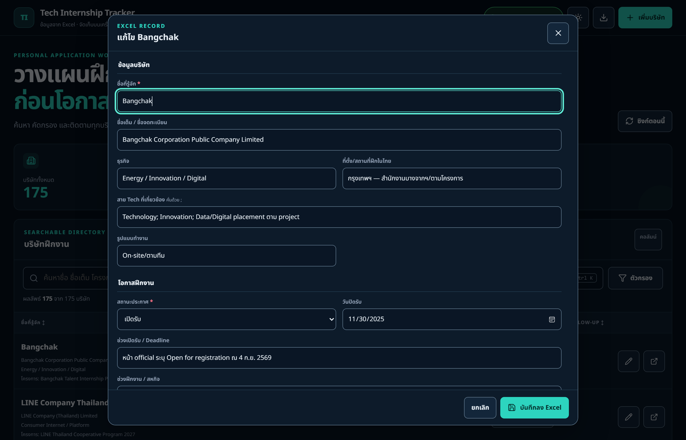
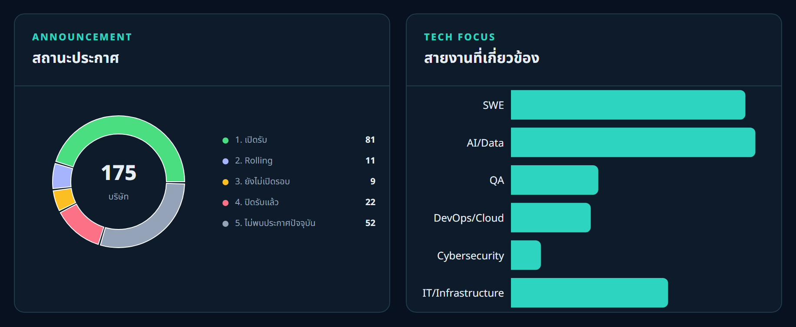

# Tech Internship Tracker

Local-first internship and cooperative-education tracker for technology roles in Thailand. The application uses one Microsoft Excel workbook as its source of truth: the website reads the workbook, writes validated changes back to it, and watches for changes made externally in Excel.

> Designed for one person on one Windows machine. There is no authentication, database, cloud storage, or multi-user merge layer.

## Features

- Thai/English search across company, legal name, open programmes, roles, location, contacts, deadlines, and notes.
- Filtering, sorting, pagination, responsive table/cards, KPI dashboard, deadline view, and charts.
- Add, edit, delete, and quick-edit tracking fields from the browser.
- Two-way local sync: browser → workbook and saved workbook → browser.
- Automatic file watching through Chokidar, SSE notifications, foreground refresh, and 30-second fallback polling.
- SHA-256 version checks to prevent overwriting a workbook changed after the page loaded.
- Excel owner-lock detection, mutex-protected writes, temporary-file verification, rollback-safe replacement, and a backup before every write.
- Preserves the workbook's three worksheets, table/filter, formulas, validation, conditional formatting, date formats, column widths, and stable record IDs. The reader also normalizes OOXML emitted by Excel-compatible exporters that ExcelJS cannot parse directly.

## Requirements

- Windows 10 or 11 (supported runtime environment).
- Node.js `>=22.13.0` and npm 10.x.
- A valid `.xlsx` workbook following the contract below.
- Microsoft Excel is optional, but must be closed while the website writes to the workbook.

## Quick start

```powershell
git clone https://github.com/01aptx01/tech-intern-tracker.git
Set-Location tech-intern-tracker
npm install
Copy-Item .env.example .env.local
```

Edit `.env.local` with absolute Windows paths:

```dotenv
EXCEL_FILE_PATH=C:\absolute\path\to\tech_internship_thailand_2569_2570.xlsx
EXCEL_BACKUP_DIR=C:\absolute\path\to\backups
APP_ORIGIN=http://127.0.0.1:3000
```

Validate the environment and workbook:

```powershell
npm run verify:environment
npm run inspect:workbook
```

Start the local application:

```powershell
npm run dev
```

Open <http://127.0.0.1:3000>. The server binds to loopback only and is not available to other devices on the network.

## Starter workbook template

Use the checked-in [tech-internship-tracker-template.xlsx](./templates/tech-internship-tracker-template.xlsx) when creating a new personal workbook. It is intentionally small and safe to copy: it contains four clearly labelled mock companies, not real applicant data. Replace the mock rows with your own records or point `EXCEL_FILE_PATH` at an existing workbook that follows the same contract.

The template includes:

- all three required worksheets and the row-4 header layout;
- the complete 25-column schema (`A:Y`), including hidden `_record_id` values;
- typed date cells, filters, frozen panes, table formatting, status/evidence dropdowns, and conditional formatting;
- formula-driven summary counts and role breakdowns; and
- example URLs and notes that demonstrate the expected shape without pretending to be live openings.

Recommended setup:

1. Copy the template outside the repository (for example, to a private `data` folder).
2. Rename it if desired, then set `EXCEL_FILE_PATH` and `EXCEL_BACKUP_DIR` in `.env.local`.
3. Keep the three worksheet names, row 4, headers, and `_record_id` column unchanged.
4. Delete or replace mock rows before adding personal application tracking data.

The web app is the safest place to add, edit, or delete rows because it preserves IDs, formulas, validations, formatting, and backups automatically.

## Interface preview

Screenshots captured directly from the running local dashboard at `http://127.0.0.1:3000`. All interface statistics and records are calculated live from the configured workbook.

### 1. Dashboard overview and KPI metrics

The header and hero area feature real-time two-way synchronization status, a manual sync trigger, light/dark theme toggle, and 5 key KPI metric cards summarizing total companies, active recruitment windows, impending deadlines, and application statuses.



### 2. Searchable company directory

Interactive directory table featuring real-time search (`Ctrl+K`), custom column visibility toggles, sortable headers, tech stack tags, announcement badges, inline user-application status dropdowns, and pagination.



### 3. Multi-criteria advanced filtering

Comprehensive filter popover supporting simultaneous filtering across announcement statuses, personal application statuses, tech focus areas, program types (Summer, Co-op, Internship), evidence ratings (A/B/C), work arrangements (On-site, Hybrid, Remote), and deadline ranges.



### 4. Company record and tracking editor

Detailed modal dialog for adding and editing company records. Validates inputs with Zod, manages technical record keys, updates private notes, and automatically triggers workbook backups before writes.



### 5. Visual analytics and role distribution

Visual charts displaying the distribution of company announcement statuses (donut chart) and the most prevalent tech roles across all recorded companies (horizontal bar chart).



### 6. Impending deadline tracking

Priority deadline panel showing upcoming application closing dates within the next 30 days, complete with countdown indicators and quick-navigation links to company details.


## Excel workbook contract

The workbook path is configured only on the server; the browser never supplies a path. The file must be a valid `.xlsx` workbook containing these worksheets:

| Worksheet | Required layout |
| --- | --- |
| `บริษัทฝึกงาน` | Title/subtitle rows above the data, headers on row 4, records from row 5, main table and filters. |
| `สรุปและลำดับดำเนินการ` | Formula-driven dashboard summary. |
| `คำอธิบายและแหล่งข้อมูล` | Status definitions, evidence criteria, and usage notes. |

### Main worksheet columns

Headers must be on row 4. Do not rename, reorder, merge, or delete these columns.

| Excel | Header | Meaning and accepted value |
| --- | --- | --- |
| A | `ลำดับ` | Display order. The server controls this when rows are added/deleted. |
| B | `ชื่อที่รู้จัก` | Common/public company or brand name. Required and unique. |
| C | `ธุรกิจ` | Business description. |
| D | `สาย Tech ที่เกี่ยวข้อง` | Semicolon-separated tags, e.g. `SWE; Data; Cloud`. |
| E | `ที่ตั้ง/สถานที่ฝึกในไทย` | Thailand office or internship location. |
| F | `รูปแบบทำงาน` | Free text such as `On-site`, `Hybrid`, or `Remote`. |
| G | `ข้อมูลติดต่อ HR / บริษัท` | Official contact details only. |
| H | `ลิงก์สมัคร/อาชีพ` | Absolute `http://` or `https://` URL. |
| I | `สถานะประกาศ` | `เปิดรับ`, `Rolling`, `ยังไม่เปิดรอบ`, `ปิดรับแล้ว`, or `ไม่พบประกาศปัจจุบัน`. |
| J | `ช่วงเปิดรับ/Deadline` | Human-readable application window. |
| K | `วันปิดรับ` | Excel date cell, formatted `yyyy-mm-dd`; blank if no deadline. |
| L | `ช่วงฝึกงาน/สหกิจ` | Human-readable internship or co-op period. |
| M | `ประเภทโปรแกรม` | Semicolon-separated tags, e.g. `Summer; Co-op; Off-cycle`. |
| N | `คุณสมบัติ/หมายเหตุ` | Eligibility and programme notes. |
| O | `แหล่งอ้างอิงหลัก` | Primary careers/internship/application URL. |
| P | `แหล่งอ้างอิงเสริม` | Supporting company or legal-information URL. |
| Q | `ตรวจสอบล่าสุด` | Excel date cell for last verification. |
| R | `ระดับหลักฐาน` | `A`, `B`, or `C`. |
| S | `สถานะของคุณ` | `ไม่รับ`, `ติดต่อแล้ว`, `กำลังดำเนินการ`, `รับแล้ว`, `เลยช่วง`, `ไม่มี`, or blank. `ไม่รับ` means rejected by the company. |
| T | `วันที่ติดต่อ` | Excel date cell. |
| U | `ติดตามครั้งถัดไป` | Excel date cell. |
| V | `หมายเหตุส่วนตัว` | Private tracking notes; do not commit the workbook. |
| W | `_record_id` | Hidden UUID v4 technical key. Never edit it or use row number as an ID. |
| X | `ชื่อเต็ม` | Full registered/legal name, or explicit group/entity description when recruitment is shared. |
| Y | `โครงการที่เปิดรับ` | Semicolon-separated current or recently verified internship programme names. |

### Excel data rules

- Leave optional cells blank; do not type the string `null`.
- Separate tag fields with `;`. The application trims whitespace and removes empty or duplicate tags.
- Store dates as date-only Excel values, not timezone-bearing text. Use `yyyy-mm-dd` for manual edits.
- Keep the table, headers, formulas, validation, conditional formatting, and column W technical key intact. The app repairs a zero-width W column to a real hidden column before its first write. URLs must remain absolute `http://` or `https://` values; the web UI renders them as safe external links.
- Do not insert rows above row 5 or change the header row. Add records through the website whenever possible.
- Text beginning with `=`, `+`, `-`, or `@` is stored as literal text to prevent formula injection.
- Company names must be non-empty and unique after case-insensitive Unicode normalization.

### Legacy workbook migration

For an older workbook that still uses `บริษัท` instead of `ชื่อที่รู้จัก`, or lacks X/Y, close Excel and run once:

```powershell
npm run migrate:company-fields
```

The migration creates a backup, adds missing fields, initializes `_record_id`, and stops if the workbook does not match the supported structure.

## Sync model

The workbook is the source of truth. Sync is local and requires the server to be running.

1. **Browser → Excel:** validate request, compare SHA-256 version, check Excel lock, create backup, write and re-read a temporary workbook, then replace the original only after verification.
2. **Excel → browser:** after Excel saves, the watcher waits for the file to stabilize, validates it, updates the snapshot, and notifies the browser through Server-Sent Events.
3. **Fallback:** the browser refetches every 30 seconds and when the tab becomes visible again.
4. **Manual check:** use the sync control in the header to read the workbook immediately.

Unsaved Excel edits are not visible to the website. Save first. If Excel is open, it may create an owner-lock file; website writes are rejected until Excel is closed.

## Safe editing workflow

1. Start the server and open the dashboard.
2. Edit from the website, or edit Excel after saving/closing any website form.
3. In Excel, press Save and wait for the sync indicator.
4. Never edit `_record_id`, rename headers, or move the workbook while the server is running.
5. For a version conflict, load the latest workbook and re-apply the draft manually. Automatic overwrite is never performed.

## Backups and restore

Backups are written to `EXCEL_BACKUP_DIR` before UUID initialization and every add/edit/delete. The application keeps the 20 newest backups and never commits them to Git.

To restore: stop the server, close Excel, copy the current workbook to a safety location, copy the selected backup over `EXCEL_FILE_PATH`, run `npm run inspect:workbook`, then restart the server.

## Error states

- **Workbook not found / invalid schema:** fix `EXCEL_FILE_PATH`, worksheet names, or row-4 headers, then restart.
- **Workbook locked (`423`):** save and close Excel, then retry. Form drafts remain in the browser.
- **Version conflict (`409`):** another process changed the workbook; load the latest snapshot before saving.
- **Backup/write failure:** the original workbook is retained; inspect the operation ID shown by the UI.
- **Port in use:** stop the process using port 3000 and keep `APP_ORIGIN` aligned with the browser URL.

## Development commands

```powershell
npm run lint
npm run typecheck
npm test
npm run test:integration
npm run build
npm run verify
```

Tests use generated temporary workbooks and never modify the configured personal workbook. GitHub Actions runs lint, type-check, tests, and a Linux production build on Ubuntu and Windows runners.

## Architecture

```text
Next.js App Router
  ├─ Server Components: initial workbook snapshot
  ├─ Client Components: search, filters, forms, table, charts, sync UX
  └─ Node.js API routes: guarded workbook mutations and download

Excel repository
  ├─ ExcelJS reader/writer and shared Zod validation
  ├─ SHA-256 snapshots, UUID identity, backup and rollback
  ├─ Mutex and owner-lock handling
  └─ Chokidar watcher → event bus → SSE → TanStack Query refresh
```

The application intentionally does not use a database, authentication, cloud storage, Microsoft Graph, OneDrive sync, or automatic web research.

### Workbook exporter compatibility

The current normalized workbook was produced by an Excel-compatible exporter that uses prefixed OOXML namespaces and package-absolute relationship targets. The server detects this format and normalizes it in memory before passing it to ExcelJS; the original workbook bytes are not rewritten during reads. A first application write may persist ExcelJS-compatible OOXML and repair the technical ID column's hidden state. Freeze-pane metadata and native hyperlink relationships are exporter-specific, so verify those presentation details in Microsoft Excel after a write.

## Privacy and security

- The workbook remains on the configured local filesystem and is not uploaded by the application.
- `.env.local`, `.xlsx`, backups, personal notes, logs, and build artifacts are ignored by Git.
- The server binds to `127.0.0.1`, rejects unexpected mutation origins, requires JSON and a custom request header, and does not accept arbitrary file paths.
- External links use `target="_blank"` with `rel="noopener noreferrer"`.
- Do not put passwords, API keys, or sensitive applicant information in the repository.

## License

[MIT](./LICENSE)
